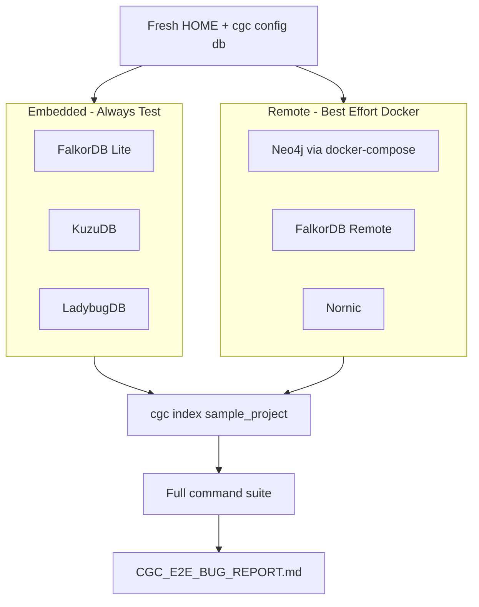

# CGC End-to-End Bug Hunt Plan

## Goal

Behave exactly like a first-time user: install from PyPI, follow published docs, run real CLI/MCP commands, compare outputs against expectations and golden baselines, and record **every** performance, accuracy, UX, and security issue in a new report file: [`CGC_E2E_BUG_REPORT.md`](CGC_E2E_BUG_REPORT.md).

**Constraints:** No source-code fixes. No pytest-as-testing — only subprocess/manual command execution. Isolated environment per backend to avoid cross-contamination.

---

## Environment Setup

### Isolated test home

CGC config is hardcoded to `~/.codegraphcontext` ([`config_manager.py`](src/codegraphcontext/cli/config_manager.py) line 19). Use a disposable home for every backend run:

```bash
export TEST_HOME=/tmp/cgc-e2e-$(date +%s)
mkdir -p "$TEST_HOME"
export HOME="$TEST_HOME"
```

### Fresh venv + PyPI install

```bash
python3 -m venv /tmp/cgc-e2e-venv
source /tmp/cgc-e2e-venv/bin/activate
pip install --upgrade pip
pip install codegraphcontext
cgc version   # record actual version (expect 0.4.15)
cgc doctor    # baseline health snapshot
```

Record Python version (`python3 --version`) — FalkorDB Lite requires **3.12+** on Linux; tree-sitter parsers are skipped on **3.13** per [`pyproject.toml`](pyproject.toml).

### Test targets (repos to index)

| Repo | Path | Purpose |
|------|------|---------|
| Python primary | [`tests/fixtures/sample_projects/sample_project/`](tests/fixtures/sample_projects/sample_project/) | Call chains (`f1→f2→f3`), decorators, edge cases |
| Multi-language sweep | All 20 `sample_project_*` dirs | Parser accuracy per language |
| Self-index | CGC repo root (small subset or full) | Real-world scale + dogfooding |
| Tiny synthetic | Hand-made 3-file repo | Watch/incremental, delete/clean edge cases |

### Expected baselines (accuracy checks)

Golden metadata for Python sample ([`tests/fixtures/goldens/sample_project/metadata.json`](tests/fixtures/goldens/sample_project/metadata.json)):
- **456 nodes, 628 edges** (generator `PYv0.4.15`)
- Per-language `nodes_have.jsonl` / `edges_have.jsonl` in [`tests/fixtures/goldens/`](tests/fixtures/goldens/) — use `cgc bundle export` + `diff`/`wc` for parity, not pytest

Prior E2E report ([`docs/test_report.md`](docs/test_report.md)) covered only FalkorDB/KuzuDB/Neo4j at v0.3.8 — **LadybugDB, FalkorDB-remote, and Nornic were never manually tested**.

---

## Backend Test Matrix



### Per-backend procedure (repeat 6× with clean `HOME`)

1. `cgc config reset` (or fresh `HOME`)
2. `cgc config db <backend>` + set paths/credentials per [`docs/docs/reference/config.md`](docs/docs/reference/config.md)
3. `cgc doctor` — capture pass/fail per check
4. `cgc index --force tests/fixtures/sample_projects/sample_project`
5. Record index duration, exit code, stderr warnings (call-resolution diagnostics)
6. `cgc stats` — compare node/edge counts to golden (456/628)
7. Run full command suite (Phase 3)
8. `cgc clean` / `cgc delete` — verify cleanup

### Remote backends (best effort)

Use [`docker-compose.template.yml`](docker-compose.template.yml) if present; otherwise:

```bash
# Neo4j
docker run -d --name cgc-neo4j -p 7474:7474 -p 7687:7687 \
  -e NEO4J_AUTH=neo4j/testpassword neo4j:5
cgc neo4j setup   # or manual config set NEO4J_*

# FalkorDB Remote
docker run -d --name cgc-falkor -p 6379:6379 falkordb/falkordb:latest
cgc config db falkordb-remote
```

If Docker unavailable or connection fails: log **SKIP** with reason in report (not a bug unless docs claim zero-config and it silently fails).

### Cross-backend parity checks

After indexing all `sample_project_*` on each backend, compare:
- Total node count, edge count, CALLS edge count
- `cgc analyze callers f2` result set (should include `f1`)
- `cgc analyze chain f1 f3` — expect chain through `f2`
- `cgc find content "Hello World"` — FalkorDB should error per docs; others should find

Flag any backend where counts diverge >5% or known symbols missing.

---

## Phase 1: New-User Onboarding (Docs Fidelity)

Follow docs in order; flag doc/code mismatches:

1. [`docs/docs/getting-started/installation.md`](docs/docs/getting-started/installation.md) — install, `cgc doctor`
2. [`docs/docs/getting-started/quickstart.md`](docs/docs/getting-started/quickstart.md) — index, stats, analyze, watch
3. [`docs/docs/guides/indexing.md`](docs/docs/guides/indexing.md) — `.cgcignore`, `--force`, skip-if-indexed
4. [`docs/docs/guides/contexts.md`](docs/docs/guides/contexts.md) — three context modes
5. [`docs/docs/getting-started/mcp-setup.md`](docs/docs/getting-started/mcp-setup.md) — MCP wiring

**Known doc drift to verify:**
- CLI ref lists 4 backends in `--database` help; code supports 6 (`nornic`, `falkordb-remote` missing from [`docs/docs/reference/cli.md`](docs/docs/reference/cli.md))
- MCP tool count: docs say 21 vs 25 in [`tool_definitions.py`](src/codegraphcontext/tool_definitions.py)
- Context docs default fallback says `kuzudb`; skill says FalkorDB Lite on Unix

---

## Phase 2: Context System Stress Test

Test resolution precedence from [`config_manager.py`](src/codegraphcontext/cli/config_manager.py) `resolve_context()`:

| Scenario | Commands | Expected | Bug-prone |
|----------|----------|----------|-----------|
| Global mode | `cgc context mode global` → index two repos → `cgc list` | Both repos visible | Cross-repo pollution |
| Per-repo mode | `cgc context mode per-repo` → index in repo A and B | Isolated DBs | Queries in B see A's data |
| Named context | `cgc context create ProjA` → `cgc index . --context ProjA` | Data in named path | Auto-create path missing |
| Default context | `cgc context default ProjA` → `cgc list` (no `-c`) | Uses ProjA | Falls through to global |
| Local `.codegraphcontext/` | Create local dir → overrides global | Per-repo wins | Precedence inversion |
| Runtime override | `cgc --db kuzudb --path /tmp/x index .` | Bypasses context DB | Silent wrong backend |
| CLI vs MCP context | Index via CLI, query via MCP same `HOME` | Same graph | MCP uses different DB |

---

## Phase 3: Full CLI Command Suite

Run every command from [`main.py`](src/codegraphcontext/cli/main.py) on indexed data. For each: record exit code, stdout shape, stderr, and whether result matches intent.

### Core lifecycle
- `cgc index`, `cgc index --force`, `cgc index` (skip re-index), interrupted index retry
- `cgc list`, `cgc stats`, `cgc clean`, `cgc delete <path>`, `cgc delete --all`
- `cgc setup-scip`, `cgc report`, `cgc visualize --port 8001`
- Shortcuts: `cgc i`, `cgc ls`, `cgc rm`, `cgc v`, `cgc w`

### Find group
- `cgc find name f1`, `cgc find name Auth --fuzzy`, `cgc find pattern "def f"`, `cgc find type function`
- `cgc find variable x`, `cgc find content "Hello"`, `cgc find decorator`, `cgc find argument`
- `--visual` flag on find commands

### Analyze group
- `cgc analyze calls f1`, `cgc analyze callers f2`, `cgc analyze chain f1 f3`
- `cgc analyze deps`, `cgc analyze tree`, `cgc analyze complexity`, `cgc analyze dead-code`
- `cgc analyze overrides`, `cgc analyze variable`, `cgc analyze kotlin-call-audit --json`

### Config / context / bundle / registry
- `cgc config show|set|reset|db`
- `cgc context list|create|delete|mode|default`
- `cgc bundle export` → `cgc bundle import --clear` (round-trip node/edge count)
- `cgc registry list|search` (network; document failures gracefully)

### Watch / incremental
- `cgc watch .` → edit file → `cgc analyze callers <new_fn>`
- `cgc watching`, `cgc unwatch`
- `ENABLE_AUTO_WATCH=true` after index (blocks terminal?)

### Datasource (smoke only — no real DB required to find CLI bugs)
- `cgc datasource mysql` with bad host — expect clean error, not traceback
- Same for `cassandra`, `redis`

### Query / security
- `cgc query "MATCH (f:Function) RETURN f.name LIMIT 5"` — JSON shape
- Attempt write query (`CREATE`, `DELETE`) — must block
- `cgc cypher` deprecated alias — warning shown?

### API gateway
- `cgc api start --port 8002` → curl health/index endpoint → stop

**Exit-code audit** (high-value bug area from code review):
- DB init failure: index returns 1, but `find`/`analyze` may return 0 silently ([`cli_helpers.py`](src/codegraphcontext/cli/cli_helpers.py) `_initialize_services` returns `None` tuple)

---

## Phase 4: MCP Server E2E

### Startup
```bash
cgc mcp tools          # list tools table
cgc mcp start            # verify stays alive; check ~/.codegraphcontext/logs/mcp.log
```

### JSON-RPC manual calls (stdio)

Send MCP initialize + `tools/list` + `tools/call` via a small one-off Python script (test harness only, not CGC source):

Priority tools to exercise (all 25 from [`tool_definitions.py`](src/codegraphcontext/tool_definitions.py)):

| Tool | Probe |
|------|-------|
| `add_code_to_graph` | Index sample_project; check job_id + `check_job_status` |
| `add_code_to_graph` (bad path) | **Known risk:** returns `success: true` per handler review |
| `find_code` | Match `cgc find name f1` results |
| `analyze_code_relationships` | `find_callers` / `call_chain` parity with CLI |
| `switch_context` / `discover_codegraph_contexts` | Context isolation |
| `execute_cypher_query` | Same as `cgc query` |
| `find_dead_code`, `calculate_cyclomatic_complexity` | vs CLI analyze |
| `watch_directory` / `list_watched_paths` | vs CLI watch |
| `load_bundle`, `search_registry_bundles` | bundle/registry path |
| `generate_report` | vs `cgc report` |
| `list_jobs`, `check_job_status` | restart server — jobs lost? |

**CLI/MCP parity matrix:** For 10 representative operations, diff CLI stdout vs MCP JSON `results` field.

---

## Phase 5: Accuracy & Performance Probes

### Parser accuracy (20 languages)

For each `sample_project_*`:
```bash
cgc index --force <project> --db <backend>
cgc bundle export /tmp/out.cgc
# Compare exported node/edge counts vs tests/fixtures/goldens/<project>/metadata.json
```

Flag languages where CALLS edges are 0 or node count drops >10% vs golden.

### Known hard cases in fixtures
- [`function_chains.py`](tests/fixtures/sample_projects/sample_project/function_chains.py) — nested calls `f1(f2(f3(10)))`
- `edge_cases/syntax_error.py` — index should complete but file missing from graph
- Java Spring (`sample_project_java`) — endpoints/beans
- C++ without `compile_commands.json` — SCIP fallback behavior
- C# — `tree_sitter_c_sharp` import on uvx path

### Performance red flags
- Index time >3× vs [`docs/test_report.md`](docs/test_report.md) baselines (FalkorDB 1.28s for 36 files)
- `cgc find content` on large repo hangs
- `cgc visualize` memory spike
- FalkorDB→KuzuDB silent fallback ([`cli_helpers.py`](src/codegraphcontext/cli/cli_helpers.py) ~103-121) — user queries wrong DB

### Security / safety
- MCP `add_code_to_graph` with path outside `CGC_ALLOWED_ROOTS` (if set)
- Path traversal in `delete_repository`
- `cgc query` injection attempts in property values

---

## Bug Report Format

Create [`CGC_E2E_BUG_REPORT.md`](CGC_E2E_BUG_REPORT.md) at repo root with:

```markdown
# CGC E2E Bug Report
- Date, CGC version (PyPI), Python version, OS
- Test matrix summary table (backend × command → PASS/FAIL/SKIP)

## Bugs
### BUG-001: <title>
- **Severity:** Critical | High | Medium | Low
- **Category:** Performance | Accuracy | UX | Security | Docs
- **Backend(s):** falkordb | kuzudb | ...
- **Repro steps:** exact commands
- **Expected:** ...
- **Actual:** ... (stdout/stderr excerpts)
- **Impact:** why this hurts new users

## Doc/UX Inconsistencies
## Skipped Tests (with reasons)
## Cross-Backend Parity Table
```

Severity guide:
- **Critical:** wrong graph data, silent data loss, security bypass
- **High:** command fails, MCP/CLI disagree, wrong backend used silently
- **Medium:** missing symbols, slow index (>3×), bad exit codes
- **Low:** doc drift, cosmetic output, deprecated warnings missing

---

## Execution Order (estimated ~4-6 hours)

1. Setup venv + PyPI install + `cgc doctor` (15 min)
2. Embedded backends full matrix — FalkorDB, KuzuDB, LadybugDB (2 hr)
3. Docker remote backends best effort — Neo4j, FalkorDB-remote (45 min)
4. Context mode stress tests on KuzuDB (45 min)
5. MCP stdio tool calls + parity (1 hr)
6. 20-language accuracy sweep on primary backend (1 hr)
7. Compile report (30 min)

---

## What We Will NOT Do

- Modify any file under [`src/`](src/)
- Run `pytest` as the testing methodology (may use golden files as reference only)
- Fix bugs during the hunt (report only)
- Push commits or open PRs
